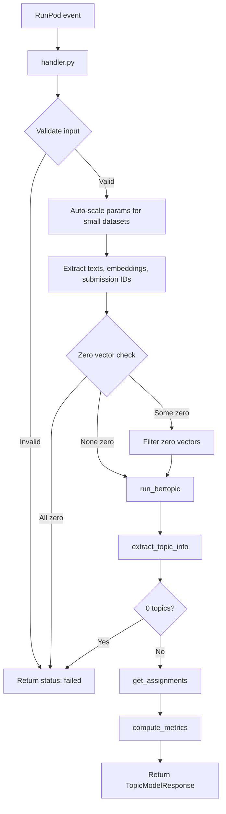

## File Structure

```
src/
├── handler.py       # RunPod entry point — validation, orchestration, error handling
├── config.py        # Constants: model name, device, version, default hyperparameters
├── models.py        # Pydantic request/response schemas (mirrors Zod DTOs in API)
├── topic_model.py   # BERTopic pipeline: UMAP → HDBSCAN → c-TF-IDF → KeyBERTInspired
└── evaluate.py      # Quality metrics: NPMI, diversity, silhouette, embedding coherence
```

## Module Responsibilities

### `handler.py` — Entry Point

The RunPod serverless handler. Performs:

1. **Input parsing** — extracts `input` from the RunPod event envelope, validates with Pydantic
2. **Parameter merging** — overlays request params onto RUN 012 defaults
3. **Auto-scaling** — adjusts `min_topic_size` and `umap_n_neighbors` for small datasets
4. **Validation** — checks minimum item count, embedding dimensionality, zero vectors
5. **Orchestration** — calls `run_bertopic()`, `extract_topic_info()`, `get_assignments()`, `compute_metrics()`
6. **Error routing** — domain errors return `status: "failed"` (no BullMQ retry); unexpected exceptions propagate to RunPod (triggers retry)

### `config.py` — Configuration

Static configuration, no environment variables:

```python
LABSE_MODEL = "sentence-transformers/LaBSE"
DEVICE = "cuda" if torch.cuda.is_available() else "cpu"
WORKER_VERSION = "1.0.0"

# RUN 012 defaults — proven optimal from experimentation
DEFAULT_PARAMS = {
    "min_topic_size": 15,
    "nr_topics": 20,
    "umap_n_neighbors": 20,
    "umap_n_components": 10,
}
```

### `models.py` — Schemas

Pydantic models that mirror the Zod schemas in `api.faculytics/src/modules/analysis/dto/topic-model-worker.dto.ts`. All models use `ConfigDict(extra="ignore")` to tolerate envelope fields (`jobId`, `version`, `type`, `metadata`, `publishedAt`) without validation errors.

### `topic_model.py` — BERTopic Pipeline

The core ML pipeline. See [Pipeline](/docs/pipeline) for details.

### `evaluate.py` — Quality Metrics

Computes five quality metrics on the fitted model. See [Metrics](/docs/metrics) for details.

## Data Flow



## Global State

The LaBSE model is loaded once at module import time (container start) and shared across all handler invocations:

```python
embed_model = SentenceTransformer(LABSE_MODEL, device=DEVICE)
```

This avoids cold-start latency on subsequent requests. The model is ~1.8 GB and is baked into the Docker image during build.
