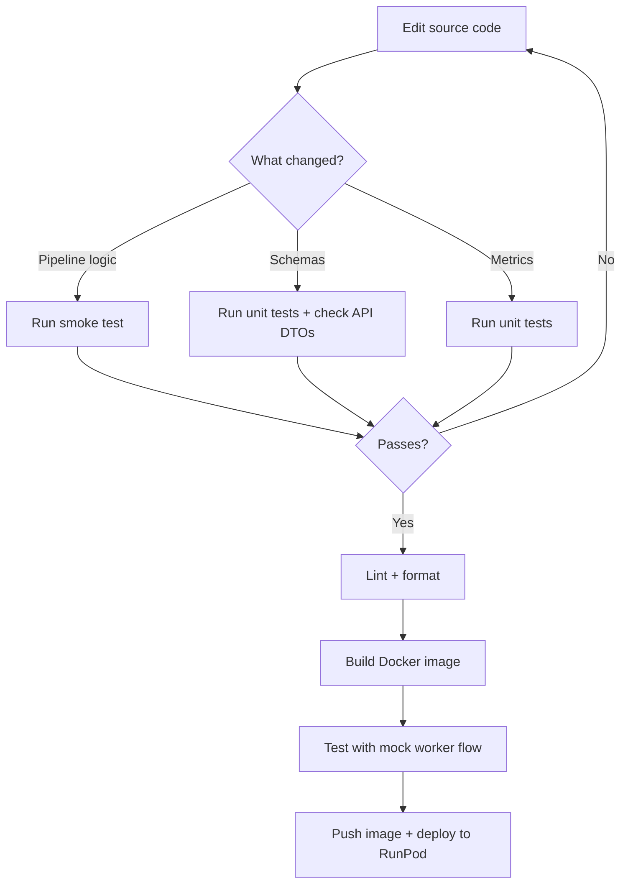

## Setup

```bash
# Install dependencies (requires Python 3.11+)
uv sync

# First run downloads LaBSE (~1.8 GB)
```

## Commands

| Command | Purpose |
| --- | --- |
| `uv sync` | Install/update dependencies |
| `uv run pytest` | Run test suite |
| `uv run ruff check src/ tests/` | Lint |
| `uv run ruff format src/ tests/` | Format |
| `uv run python test_local.py` | Local smoke test |

## Testing Strategies

### 1. Unit Tests (`uv run pytest`)

Standard pytest tests in `tests/`. Test individual functions in isolation — metric computation, parameter scaling, schema validation, etc.

### 2. Local Smoke Test (`test_local.py`)

Calls `handler()` directly with 30 synthetic items and clustered embeddings. Bypasses RunPod entirely.

```bash
uv run python test_local.py
```

What it does:
- Generates 30 items with sample multilingual texts
- Creates synthetic 768-dim embeddings with 3 artificial clusters (shifted by `cluster * 2`)
- Uses reduced params: `min_topic_size=5`, `nr_topics=3`, `umap_n_neighbors=10`
- Prints discovered topics, assignments, outlier count, and metrics

Works on CPU (slow, ~30-60s) or GPU (fast, ~5-10s). First run downloads LaBSE if not cached.

### 3. Mock Worker (API Integration Test)

The API repo includes a mock worker that returns fake topic modeling results. Use this to test the full pipeline flow without running the real BERTopic worker:

```bash
cd ../api.faculytics
docker compose up          # starts Redis + mock worker on port 3001
```

Then set in the API's `.env`:

```bash
TOPIC_MODEL_WORKER_URL=http://localhost:3001/topic-model
```

The mock worker returns pre-built topics, assignments, and metrics, allowing you to test the `TopicModelProcessor`'s persistence logic, pipeline advancement, and downstream stages (topic labeling, recommendations).

## Development Workflow



## Schema Sync

The Pydantic models in `src/models.py` must match the Zod schemas in:

```
api.faculytics/src/modules/analysis/dto/topic-model-worker.dto.ts
```

When changing request/response shapes:

1. Update the Pydantic models in `src/models.py`
2. Update the Zod schemas in the API's `topic-model-worker.dto.ts`
3. Verify alignment by running the API's mock worker tests

All Pydantic models use `ConfigDict(extra="ignore")` — extra fields in the request (like `jobId`, `metadata`, `publishedAt`) are silently dropped during validation, keeping the worker decoupled from envelope format changes.

## Code Style

- **Formatter**: Ruff with `line-length = 100`
- **Lint rules**: `E` (pycodestyle), `F` (pyflakes), `I` (isort), `UP` (pyupgrade)
- **Target**: Python 3.11
