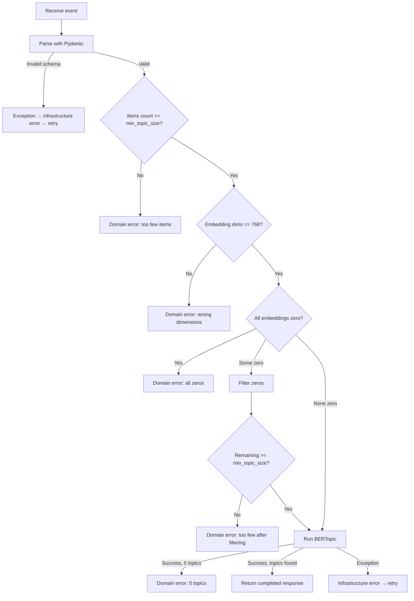

The worker uses a two-tier error strategy designed to work with BullMQ's retry mechanism through the RunPod serverless layer.

## Error Categories

### Domain Errors (No Retry)

Failures caused by the input data — retrying with the same data would produce the same failure. These return a normal response with `status: "failed"` and an `error` message.

```json
{
  "version": "1.0.0",
  "status": "failed",
  "error": "Received 8 items, need at least 15 (min_topic_size) for topic modeling",
  "completedAt": "2026-03-21T10:00:00.000Z"
}
```

RunPod wraps this in `{ output: { ... } }` and returns HTTP 200. The API's `TopicModelProcessor` sees `status: "failed"`, marks the `TopicModelRun` as failed with the error message, and advances the pipeline to `FAILED`. BullMQ does **not** retry.

**Domain error conditions:**

| Condition | Error Message |
| --- | --- |
| Too few items | `Received N items, need at least M (min_topic_size) for topic modeling` |
| Wrong embedding dimensions | `Expected 768-dim embeddings, got N` |
| All embeddings are zero vectors | `All embeddings are zero vectors` |
| Too few items after filtering zeros | `After filtering zero vectors, only N items remain (need M)` |
| BERTopic produces no topics | `BERTopic produced 0 topics` |

### Infrastructure Errors (Retry)

Unexpected failures — OOM, CUDA errors, library bugs, etc. These raise exceptions, which RunPod catches and returns as an error status. BullMQ sees the error and retries with exponential backoff.

```python
except Exception:
    logger.exception("Unexpected error in handler")
    raise  # RunPod returns error → BullMQ retries
```

The retry configuration is on the API side:

| Setting | Default |
| --- | --- |
| `BULLMQ_DEFAULT_ATTEMPTS` | 3 |
| `BULLMQ_DEFAULT_BACKOFF_MS` | 5000 (initial) |
| `BULLMQ_TOPIC_MODEL_HTTP_TIMEOUT_MS` | 300000 (5 min) |

## Validation Flow



## Zero Vector Handling

Embeddings that are zero vectors (norm < 1e-8) are filtered before topic modeling:

1. Compute L2 norm for each embedding
2. If **all** are zero → domain error
3. If **some** are zero → log a warning, filter them out, and check remaining count
4. The corresponding texts and submission IDs are also filtered to maintain alignment

This handles edge cases where the embedding worker returned zeros for certain inputs (e.g., empty strings that passed cleaning).

## Auto-Scaling as Error Prevention

Rather than failing immediately on small datasets, the handler auto-scales parameters:

```python
if n_items < min_topic_size * 4:
    scaled_min = max(5, n_items // 5)
    max_neighbors = max(5, n_items - 1)
```

This prevents UMAP from raising `ValueError` when `n_neighbors > n_samples` and gives HDBSCAN a better chance of finding clusters in small datasets. The minimum `min_topic_size` floor is 5 — below this, topic modeling results are unlikely to be meaningful.
