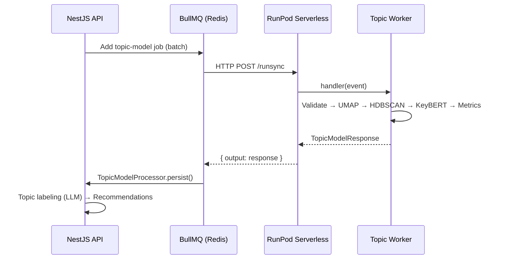

The topic modeling worker is a GPU-accelerated microservice that discovers recurring themes in student feedback using [BERTopic](https://maartengr.github.io/BERTopic/index.html). It receives pre-cleaned text and pre-computed LaBSE embeddings from the NestJS API, runs unsupervised clustering, and returns discovered topics with per-document assignments and quality metrics.

## How It Fits in the System

The worker sits in the middle of the [analysis pipeline](/docs/workflows/analysis-pipeline):

1. **Sentiment analysis** runs first, scoring every submission
2. A **sentiment gate** filters the corpus (negative/neutral pass; positive needs ≥10 words)
3. **This worker** receives the filtered submissions with their LaBSE embeddings
4. After topics are discovered, the API runs **topic labeling** (LLM) and then **recommendations**

## Key Characteristics

| Property | Value |
| --- | --- |
| Runtime | RunPod serverless (GPU) |
| Language | Python 3.11 |
| ML Stack | BERTopic, UMAP, HDBSCAN, KeyBERTInspired |
| Embedding model | LaBSE (768-dim, baked into Docker image) |
| Input | Pre-cleaned text + pre-computed embeddings |
| Output | Topics, assignments, quality metrics |
| Error strategy | Domain errors → `status: "failed"` (no retry); infrastructure errors → exception (RunPod retries) |

## Design Principles

- **No preprocessing** — text arrives pre-cleaned (`cleanedComment`) from the API. The worker never modifies input text.
- **No database access** — the worker is pure compute. All persistence is handled by the NestJS API after receiving results.
- **Pre-computed embeddings** — LaBSE embeddings are generated separately by the embedding worker and stored in pgvector. The topic worker receives them as input, avoiding redundant computation.
- **LaBSE loaded once** — the model is baked into the Docker image and loaded at container start. It's used only for KeyBERTInspired keyword extraction, not for document embedding.
- **Deterministic seeds** — UMAP and NumPy use `random_state=42` for reproducible results across runs with the same input.
