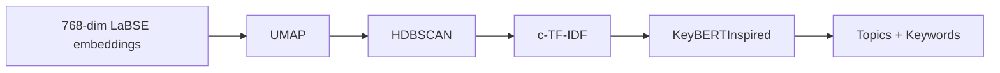

The topic modeling pipeline uses [BERTopic](https://maartengr.github.io/BERTopic/index.html) with custom sub-models for each stage. All stages run inside `run_bertopic()` in `src/topic_model.py`.

## Pipeline Stages



### 1. Dimensionality Reduction (UMAP)

Reduces 768-dim LaBSE embeddings to a lower-dimensional space suitable for clustering.

| Parameter | Default | Purpose |
| --- | --- | --- |
| `n_neighbors` | 20 | Local neighborhood size — higher values capture more global structure |
| `n_components` | 10 | Output dimensions — 10 preserves more structure than the typical 5 |
| `min_dist` | 0.0 | Packs points tightly for clustering (always 0.0) |
| `metric` | cosine | Distance metric matching LaBSE embedding space |
| `random_state` | 42 | Deterministic output |

### 2. Clustering (HDBSCAN)

Groups reduced embeddings into clusters. Documents that don't fit any cluster become outliers (topic -1).

| Parameter | Default | Purpose |
| --- | --- | --- |
| `min_cluster_size` | 15 (= `min_topic_size`) | Minimum documents per topic |
| `min_samples` | 5 | Core point threshold — lower allows sparser clusters |
| `metric` | euclidean | Distance in UMAP-reduced space |
| `cluster_selection_method` | eom | Excess of Mass — prefers variable-density clusters |
| `prediction_data` | true | Required for soft clustering probabilities |

### 3. Topic Representation (c-TF-IDF)

BERTopic's class-based TF-IDF extracts keywords that distinguish each cluster from the corpus.

The `CountVectorizer` is configured with:

- **`ngram_range=(1, 2)`** — captures single words and bigrams (e.g., "teaching method")
- **`stop_words=MULTILINGUAL_STOP_WORDS`** — filters English, Cebuano, and Tagalog function words (see [Multilingual Support](/docs/multilingual))
- **`min_df=1`** — prevents crashes on small clusters where rare terms would otherwise be excluded

### 4. Keyword Refinement (KeyBERTInspired)

After c-TF-IDF, BERTopic re-ranks keywords using cosine similarity between keyword embeddings and the cluster centroid embedding. This is where the globally-loaded LaBSE model is used — it encodes the candidate keywords and selects those most semantically similar to the topic's documents.

This step produces more coherent keyword lists than raw c-TF-IDF alone, especially for multilingual text where surface-level word frequency can be misleading.

## Topic Reduction

When `nr_topics` is set (default: 20), BERTopic merges similar clusters until the target count is reached. This uses hierarchical agglomerative merging based on c-TF-IDF similarity between topics.

If the initial HDBSCAN clustering produces fewer topics than `nr_topics`, no merging occurs.

## Auto-Scaling for Small Datasets

The handler automatically adjusts parameters when the dataset is too small for the defaults:

```python
if n_items < min_topic_size * 4:
    scaled_min = max(5, n_items // 5)        # min_topic_size floor: 5
    max_neighbors = max(5, n_items - 1)      # UMAP can't exceed dataset size
```

This prevents HDBSCAN from producing zero clusters and UMAP from failing when `n_neighbors > n_samples`.

## Output Extraction

### `extract_topic_info(model)`

Iterates over `model.get_topic_info()` and extracts:

- `topicIndex` — BERTopic's integer topic ID (0, 1, 2, ...)
- `rawLabel` — auto-generated label (e.g., `"0_fast_rushed_pace"`)
- `keywords` — top 10 keywords from `model.get_topic(topic_id)`
- `docCount` — number of documents in the cluster

Topic -1 (outliers) is excluded from the output.

### `get_assignments(model, texts, submission_ids, embeddings)`

Builds per-document assignments:

- Skips outlier documents (topic -1)
- Extracts probability from `model.probabilities_` (scalar for unreduced, matrix max for reduced topics)
- Returns `submissionId`, `topicIndex`, and `probability` (rounded to 4 decimal places)

## RUN 012 Defaults

The default hyperparameters come from the experimentation project (`topic-modeling.faculytics`), where RUN 012 achieved the best balance of coherence, diversity, and outlier ratio on the Faculytics dataset:

| Parameter | Value | Rationale |
| --- | --- | --- |
| `min_topic_size` | 15 | Large enough for meaningful topics, small enough to capture nuance |
| `nr_topics` | 20 | Target count that balances granularity vs. noise for typical class sizes |
| `umap_n_neighbors` | 20 | Captures broader structure in the embedding space |
| `umap_n_components` | 10 | More dimensions than typical (5) preserves information in 768-dim embeddings |
